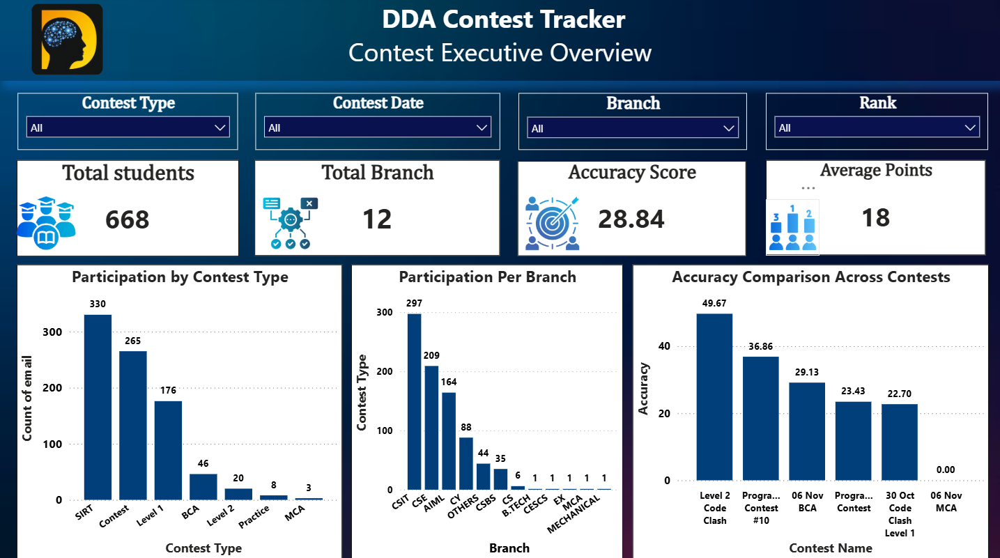
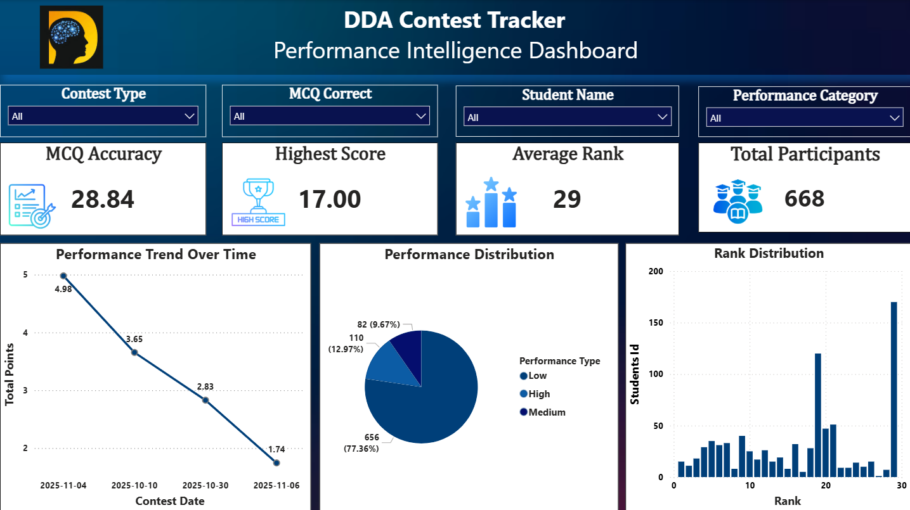

# 📊 Student Performance Analytics (DDA)

An end-to-end **Data Analytics and Power BI project** designed to analyze student contest performance, rankings, accuracy, MCQ results, programming performance, and participation trends. The project transforms raw contest and leaderboard data into meaningful insights that support performance evaluation and data-driven decision-making.

---

## 📌 Project Overview

The **Student Performance Analytics (DDA)** is an interactive Business Intelligence solution developed using **Power BI and SQL**. The project analyzes student performance across different contests and provides a centralized view of rankings, accuracy, scores, programming performance, and participation trends.

The dashboard helps transform complex leaderboard data into actionable insights through interactive visualizations, KPIs, and performance analysis.

### Key Areas of Analysis

* 👥 Student Participation
* 🏆 Contest Rankings
* 🎯 Accuracy Analysis
* 📝 MCQ Performance
* 💻 Programming Performance
* 📊 Contest-Wise Trends
* 📈 Performance Classification
* 🔍 Student Performance Analysis

---

## 🎯 Project Objectives

The key objectives of this project are:

* Analyze overall student contest performance.
* Track student participation across different contests.
* Evaluate student rankings and total points.
* Analyze accuracy and overall performance trends.
* Measure MCQ and programming performance.
* Compare performance across branches and colleges.
* Identify High, Medium, and Low-performing students.
* Provide insights that support targeted improvement and data-driven decisions.

---

## ❓ Problem Statement

Contest and leaderboard data often contain large volumes of information distributed across multiple datasets. Manually analyzing this information can make it difficult to track student performance, compare results, and identify meaningful trends.

This project addresses these challenges by developing an interactive **Power BI dashboard** that consolidates contest and student performance data into a centralized analytical solution.

The dashboard helps answer questions such as:

* Which students are performing well?
* How does performance vary across contests?
* Which students have higher accuracy?
* How do students perform in MCQ and programming sections?
* How does performance vary across branches and colleges?
* Which students fall into High, Medium, or Low performance categories?
* What are the major participation and performance trends?

---

## 🗂️ Dataset Overview

The project uses **4 tables** to build a structured analytical data model.

### 1️⃣ `dim_contest`

Contains information related to contests.

| Column         | Description                        |
| -------------- | ---------------------------------- |
| `contest_date` | Date of the contest                |
| `contest_name` | Name of the contest                |
| `contest_id`   | Unique identifier for each contest |
| `contest_type` | Type of contest                    |

---

### 2️⃣ `dim_student_year`

Contains academic information related to students.

| Column            | Description               |
| ----------------- | ------------------------- |
| `branch`          | Student branch            |
| `course_duration` | Duration of the course    |
| `current_year`    | Current academic year     |
| `email`           | Student email             |
| `passout_year`    | Student passing year      |
| `student_id`      | Unique student identifier |

---

### 3️⃣ `dim_students`

Contains student master information.

| Column           | Description               |
| ---------------- | ------------------------- |
| `branch`         | Student branch            |
| `college`        | Student college           |
| `email`          | Student email             |
| `name`           | Student name              |
| `passout_year`   | Student passing year      |
| `student_id`     | Unique student identifier |
| `total_students` | Total student count       |

---

### 4️⃣ `fact_leaderboard`

The main fact table containing contest performance and leaderboard information.

| Column                    | Description                   |
| ------------------------- | ----------------------------- |
| `accuracy`                | Student accuracy              |
| `average_accuracy`        | Average accuracy              |
| `branch`                  | Student branch                |
| `college`                 | Student college               |
| `contest_date`            | Contest date                  |
| `contest_id`              | Contest identifier            |
| `contest_name`            | Contest name                  |
| `contest_type`            | Contest category/type         |
| `email`                   | Student email                 |
| `mcq_correct`             | Number of correct MCQ answers |
| `mcq_total`               | Total MCQ questions           |
| `name`                    | Student name                  |
| `passout_year`            | Student passing year          |
| `performance_type`        | Performance classification    |
| `programming_point`       | Points earned in programming  |
| `programming_solved`      | Programming problems solved   |
| `rank`                    | Student contest rank          |
| `student_id`              | Student identifier            |
| `total_points`            | Total points scored           |
| `total_programming_point` | Total programming points      |

---

## 🏗️ Data Modeling

The project follows a **dimensional data modeling approach**, where the `fact_leaderboard` table acts as the central fact table and the remaining tables provide descriptive information.

### Fact Table

* `fact_leaderboard`

### Dimension Tables

* `dim_contest`
* `dim_student_year`
* `dim_students`

### Key Relationships

```text id="sm6ah3"
dim_contest
    │
    │ contest_id
    ▼
fact_leaderboard
    ▲
    │ student_id
    │
dim_students
    │
    │ student_id
    │
dim_student_year
```

### Relationship Logic

* `dim_contest[contest_id]` → `fact_leaderboard[contest_id]`
* `dim_students[student_id]` → `fact_leaderboard[student_id]`
* `dim_student_year[student_id]` → `fact_leaderboard[student_id]`

This structure supports efficient filtering, aggregation, and performance analysis across contests and students.

---


### 📈 Performance Analysis

* Total Points
* Student Rankings
* Average Accuracy
* Overall Performance
* Performance Classification

### 📝 MCQ Analysis

* MCQ Correct Answers
* Total MCQ Questions
* Accuracy Comparison
* Contest Performance

### 💻 Programming Analysis

* Programming Points
* Problems Solved
* Total Programming Points
* Programming Performance Comparison

### 👥 Student Analysis

* Student Participation
* Individual Performance
* Ranking Analysis
* Performance Classification

### 🏆 Contest Analysis

* Contest-Wise Performance
* Contest Participation Trends
* Contest Type Analysis
* Performance Comparison

---

# 📸 Dashboard Preview

## Dashboard 1




---

## Dashboard 2



---

## 📈 Key Insights

The dashboard helps identify:

* Overall student participation across different contests.
* Top-performing students based on rankings and total points.
* Accuracy trends across students and contests.
* Performance differences between MCQ and programming sections.
* Branch and college-wise performance patterns.
* Students classified into High, Medium, and Low performance categories.
* Contest-wise performance and participation trends.


---

## 💡 Recommendations

Based on the analysis, the following actions can support performance improvement:

* Provide targeted mentoring for students requiring additional support.
* Conduct programming practice sessions to improve problem-solving skills.
* Analyze accuracy trends to identify areas for conceptual improvement.
* Track student performance consistently across multiple contests.
* Use performance classification to create focused improvement strategies.
* Compare branch and college-level performance to identify improvement opportunities.
* Recognize top-performing students to encourage continued participation and motivation.

---

## 🛠️ Tools & Technologies

| Tool / Technology   | Purpose                                              |
| ------------------- | ---------------------------------------------------- |
| **Power BI**        | Dashboard development and data visualization         |
| **SQL**             | Data querying, analysis, and transformation          |
| **MySQL**           | Database management and SQL operations               |
| **DAX**             | Creating measures, KPIs, and analytical calculations |
| **Microsoft Excel** | Data preparation and analysis                        |
| **Data Modeling**   | Building relationships between tables                |
| **Git & GitHub**    | Version control and project documentation            |

---

## 💡 Skills Demonstrated

* Data Analysis
* Data Visualization
* **SQL**
* **MySQL**
* Power BI
* DAX
* Data Cleaning
* Data Transformation
* Data Modeling
* KPI Development
* Performance Analysis
* Dashboard Development
* Business Intelligence
* Analytical Thinking

---

## 🖼️ Images

The repository contains two Power BI dashboard screenshots:

```text id="afwg99"
images/
├── Contest Executive Overview.png
└── Performance Intelligence Dashboard.png
```

These screenshots provide a visual preview of the dashboards developed for this project.

---

## 🚀 Project Workflow

```text id="gu0fz7"
Raw Data
   ↓
SQL Data Analysis & Preparation
   ↓
Data Cleaning & Transformation
   ↓
Data Modeling
   ↓
DAX Calculations & KPI Development
   ↓
Power BI Dashboard Development
   ↓
Performance Analysis
   ↓
Actionable Insights
```

---

## 🎯 Project Outcome

This project demonstrates how **SQL, Power BI, DAX, and Data Analytics** can transform raw contest and leaderboard data into an interactive reporting solution.

The dashboard provides a centralized view of student and contest performance, making it easier to analyze participation, rankings, accuracy, programming skills, and overall performance trends.

---

## 👤 Author

**ROZ RAJAK **
